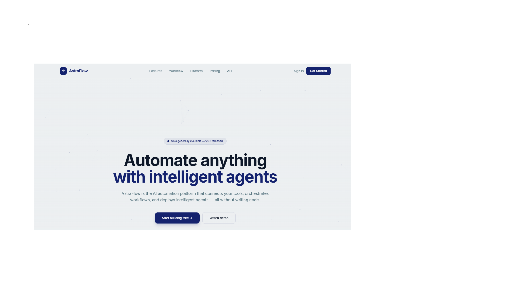

# AstraFlow — AI Automation Platform


## Overview

AstraFlow is a fictional AI automation platform landing page. Built to practice professional frontend architecture, scroll animations, Canvas API, and full deployment workflows with GitHub and Vercel.

## Live Demo

🔗 [View Live Site](https://astra-flow-mocha.vercel.app)

## Screenshot



## Tech Stack

- HTML5 (semantic structure)
- Tailwind CSS (utility-first styling via CDN)
- Vanilla JavaScript (ES6+)
- Canvas API (animated particle network hero)
- Deployed on Vercel via GitHub

## Features

- Animated particle network hero background
- Visual AI workflow pipeline diagram with flow animations
- Dark dashboard product mockup with live bar charts
- Terminal typing animation (CLI demo section)
- Responsive mobile navigation with smooth toggle
- Feature cards, case studies, and pricing section
- Email capture CTA with form handling
- Scroll reveal animations via IntersectionObserver
- Logo marquee with infinite scroll
- OG image and full social meta tags

## Project Structure

```
astraflow/
├── assets/
│   └── images/         # og-image, favicon files
├── css/
│   └── style.css       # custom CSS, animations, components
├── js/
│   └── main.js         # canvas, terminal, scroll, interactions
├── index.html          # entry point
├── README.md
└── .gitignore
```

## Run Locally

```bash
git clone https://github.com/terminal-flow/astraflow.git
cd astraflow
# Open index.html with Live Server in VS Code
```

## License

MIT © Terminal Flow
